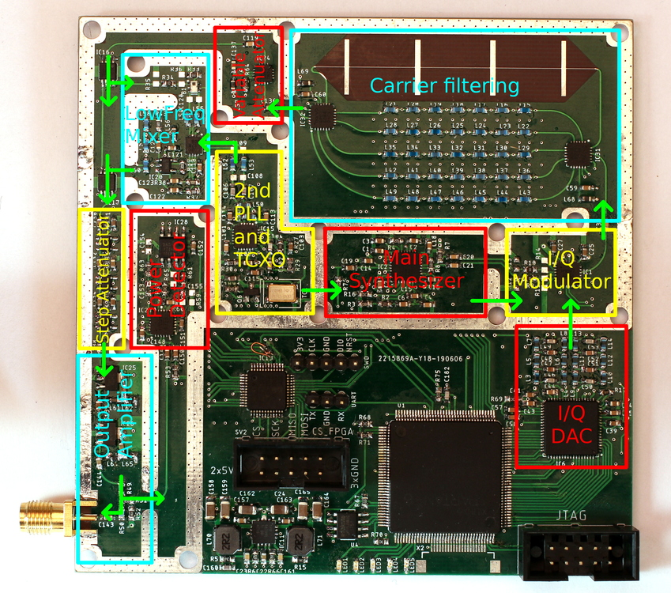

# RF Section
How does the synthesizer generate its signal? First, a blockdiagram of the RF section:

The signal starts all the way on the left with the main PLL (MAX2871) which generates a sine wave with a frequency range of 250MHz to 2.1GHz. At the next stage some modulation is applied to the signal. In this case a HMC1097 I/Q modulator is used, which contains both mixers as well as the +/-45° phase shift of the carrier. The I/Q inputs are fed by a DAC which gets its signal from an FPGA. This configuration allows to generate pretty much any modulation desired.
After the modulation the signal is passed through a filter bank. Why is that necessary? The MAX2871 doesn't have a VCO covering the whole frequency range. Instead it divides down the VCO for lower output frequencies. This means there are a lot of harmonics still present in the signal. A filter is required that removes these harmonics. As the signal frequency can be changed instead of one filter a whole filter bank is needed.
How many filters are required? Assuming ideal lowpass filters, each filter could cover a frequency range of f to just below 2*f. Any wider and the second harmonic at f would also pass through. For this snythesizer this would mean four filters:

* 500MHz lowpass for 250MHz<=f<500MHz
* 1000MHz lowpass for 500MHz<=f<1000MHz
* 2000MHz lowpass for 1000MHz<=f<2000MHz
* 4000MHz lowpass for 2000MHz<=f<2100MHz

However, actual lowpass filters have a transition band in which the attenuation is low. The cutoff-frequency of each filter must therefor be quite a bit below the lowest possible second harmonic, leading to six filters for this design.
The number of filters is also the reason why the main PLL only goes down to 250MHz. Both the MAX2871 and the HMC1097 could handle lower frequencies, but that would require significantly more filters. Instead the signal is mixed with a fixed frequency of 1GHz from a second PLL for frequencies below 250MHz. In this case the main PLL is set to 1GHz above the actual output frequency . For example, a 100MHz output signal would be generated by setting the main PLL to 1.1GHz. After filtering the signal is down converted by the second PLL and its mixer to 100MHz. The mixer also produces the sum of the frequencies (in this case 2.1GHz) but this is easily filtered out by the following 250MHz lowpass.

All that is left to do is controlling the output level. Various attenuators before the final output amplifier stage are controlled by a microcontroller. Right at the output the signal is split and the weaker part of it fed back into a detector which is sampled by the microcontroller. This closes the level control loop (Initially a analog output level control with an opamp was used. This was actually faster and easier than the digital solution but didn't work well in combination with amplitude modulation. The level control circuit would try to compensate for the amplitude changes from the modulation).

The signal path can also be followed on this PCB overlay:
 
