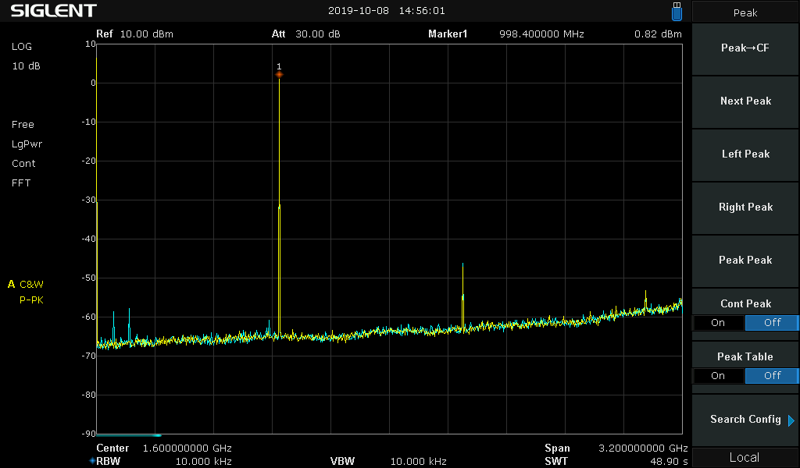
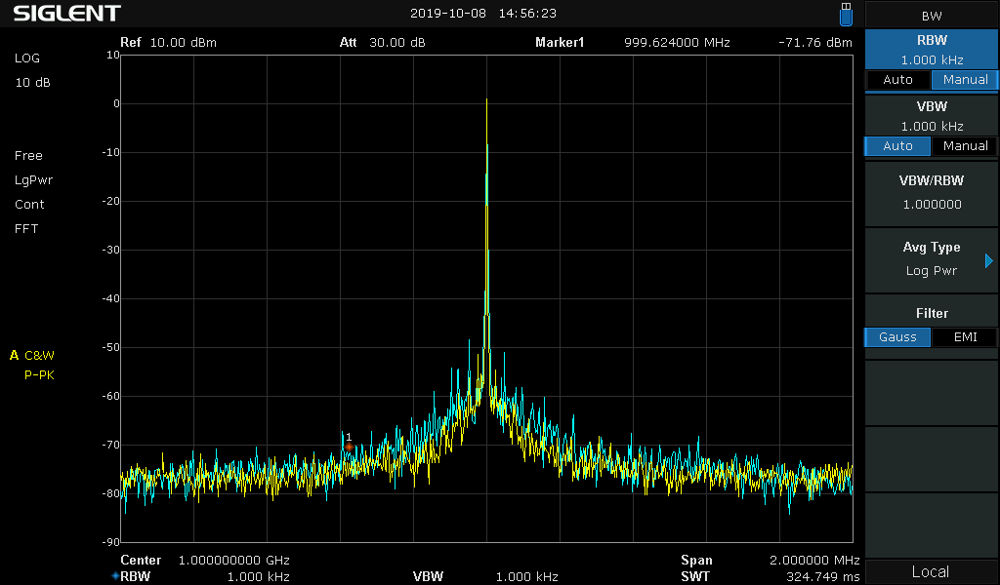
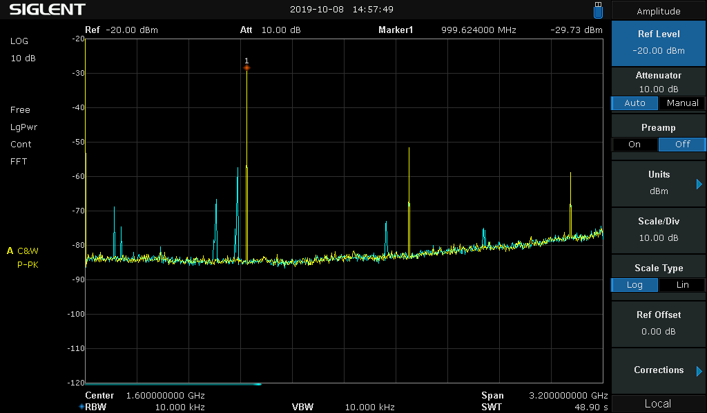
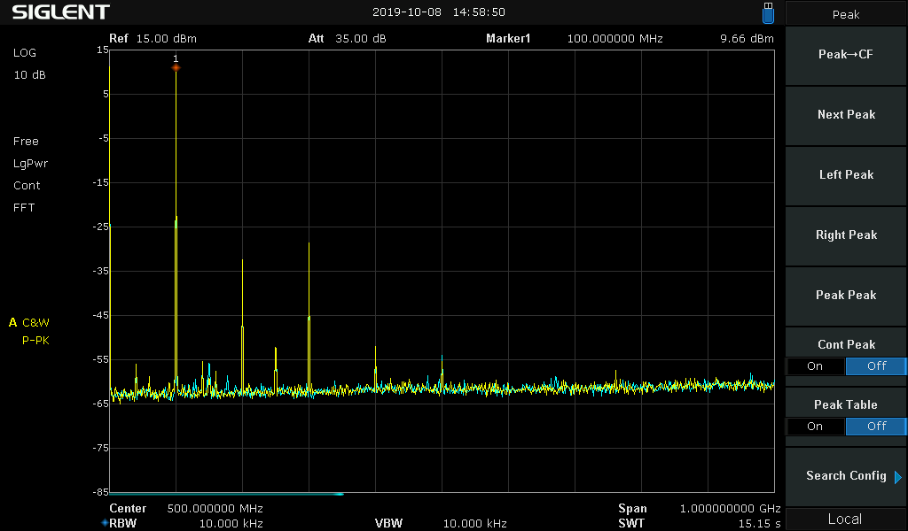
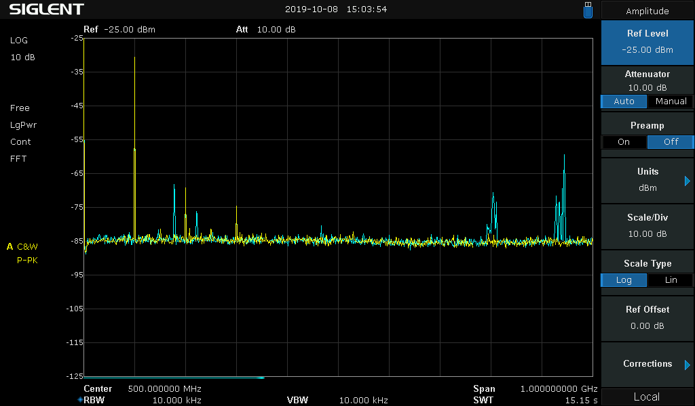
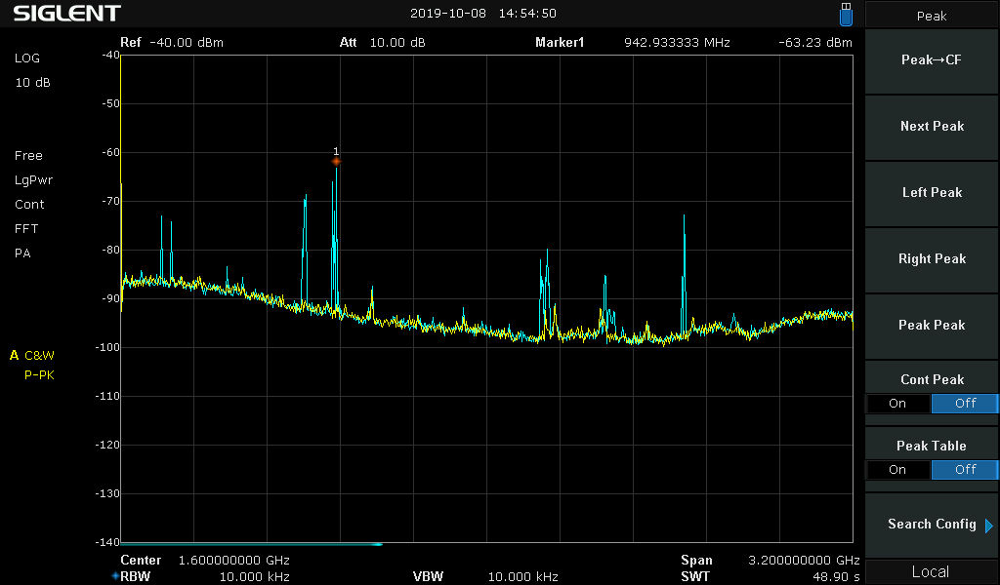

# Shielding
The critical sections of the RF board are covered by a machined aluminium shield:

The shield is supposed to block external RF from entering the signal generation, prevent emission of unwanted RF signals and shield the different sections from each other. Despite not having RF gaskets and thus probably not the best contact to the PCB ground, it improved the output signal quality significantly, especially unwanted tones when the output attenuation was high.

In the following measurements, the cyan trace shows the output signal without the shield, the yellow trace with the shield:
### 1GHz@0dbm:

If you zoom in, the phasenoise also improved slightly:

### 1GHz@-30dbm:
The shield removes quite a few unwanted tones.

### 100MHz@+10dbm:
Not much improvement here, the output driver already distorts quite a bit at this frequency and power.

### 100MHz@-10dbm:
Again, the shield removes unwanted tones.

### 100MHz@-30dbm:
Again, the shield removes unwanted tones.

### Output disabled:
Even with the output switched off, the noisefloor is not especially good. This is probably caused by the output amplifiers that are directly connected to the output (any attenuation is done before the final amplification).

During this measurement all PLLs, mixers and RF switches were turned off. The generated tones with no shield are external RF signals that are amplified by the output amplifier.

