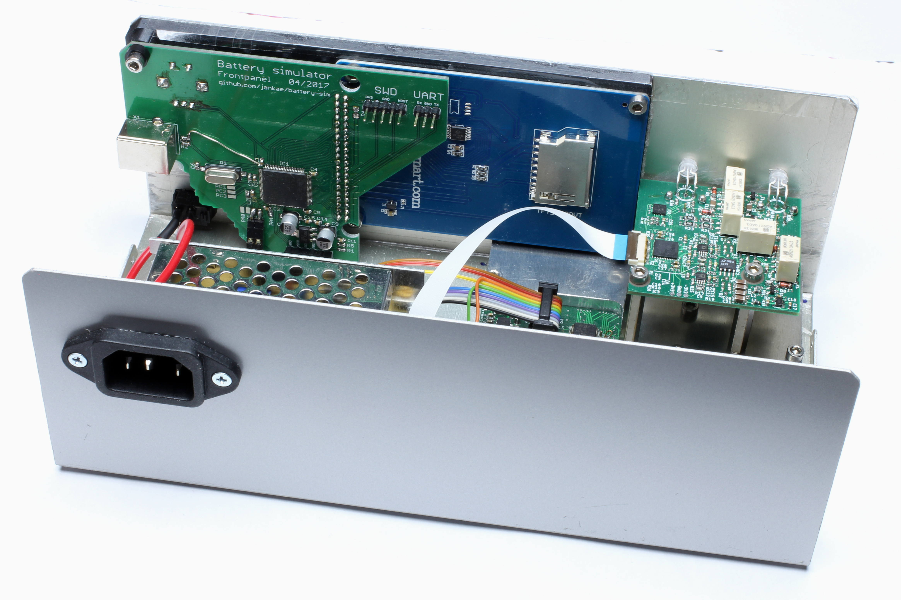
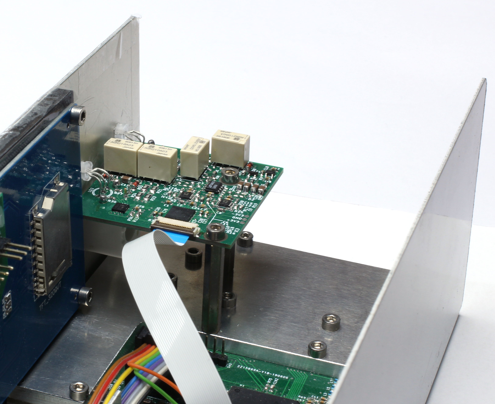

# Signalgenerator

## What is it?
A homemade RF signal generator with these features:
* Frequency range: 5MHz to 2.1GHz
* Amplitude range: approx. -40dbm to +15dbm (slightly frequency dependent)
* Modulation
  * AM
  * FM
    * Up to 12.5MHz frequency deviation
  * QAM
    * Up to 32 constellation points
    * Up to 33M samples per second
    * Up to 36 samples per symbol
    * Pulse-shaping and differential encoding
  * External I/Q inputs
    * AC/DC coupling
    * Up to +30dbm/10Vpk input
    * Up to 10MHz of bandwidth
* Spectral purity@+10dbm:
  * Harmonic:
    * f >= 150MHz: <-30dbc
    * f >= 10MHz: <-25dbc
    * f < 10MHz: <-15dbc
  * Non-harmonic:
    * <-50dbc (limited by noise floor for lower output power)
  * Phase noise:
    * <-80dbc/Hz@10kHz offset
    
    
## Why was it build?
* Gain experience with RF circuit design
* Unwilling to pay the price for commercial generators (of course this one can't compete with a commercial one but should be good enough for simple RF experiments)

## How does it work?
For a high level overview see the description of the [RF generation](Documentation/RF.md).
For the effect of RF shielding see [these](Documentation/Shielding.md) measurements.

## More Pictures:
The inside: (I reused the frontpanel PCB from [this](https://github.com/jankae/battery-sim) project)

The external modulation input PCB:

The main RF board:

